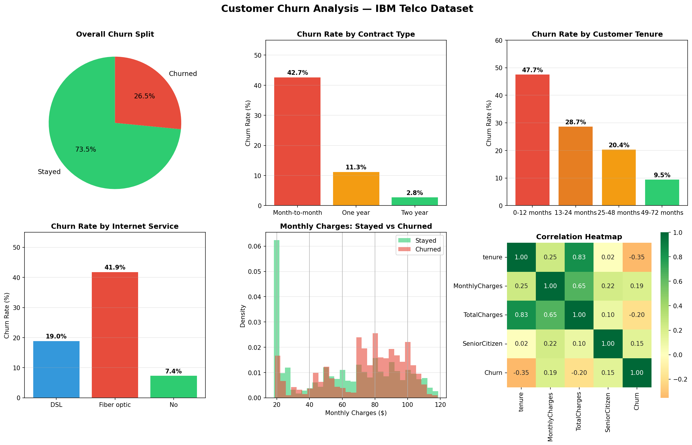
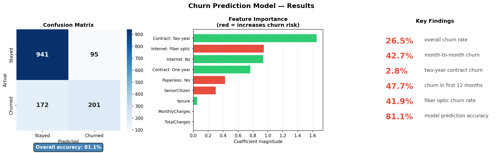

# customer-churn-analysis-
# Customer Churn Analysis

End-to-end churn analysis on 7,043 IBM Telco customers using
Python — from data cleaning to insight visualisation to a
machine learning prediction model.

## Results
- Model accuracy: 81.1%
- Dataset: 7,043 customers, 21 features
- Overall churn rate: 26.5%

## Key insights
- Month-to-month contracts churn at 42.7% vs 2.8% on 2-year
- 47.7% of customers leave in their first 12 months
- Fiber optic churn rate: 41.9% despite premium pricing
- Contract type is the single strongest churn predictor

## Tools used
Python · Pandas · Scikit-learn · Matplotlib · Seaborn · Google Colab

## Charts

